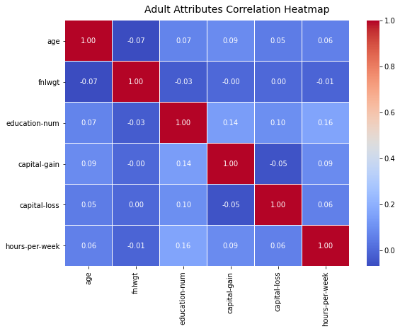
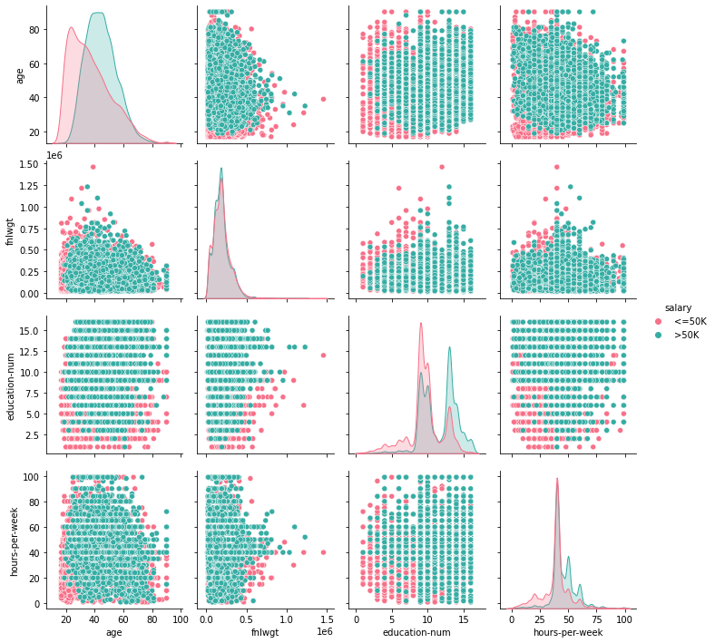
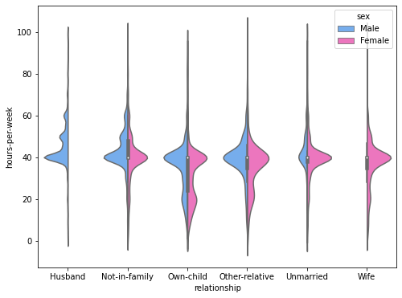
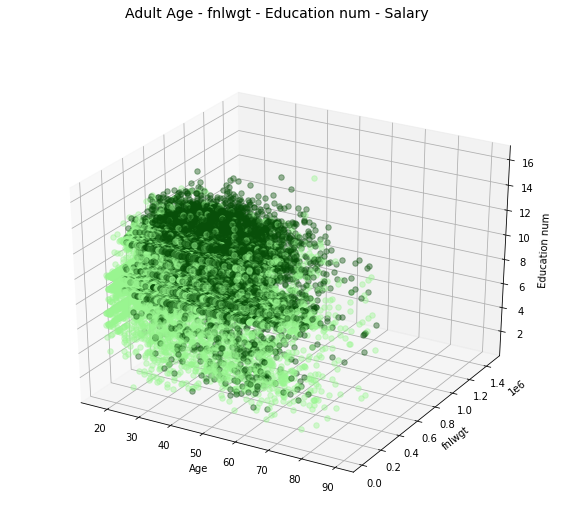
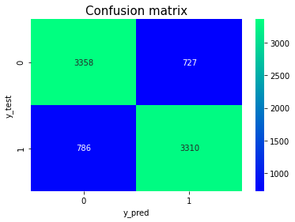
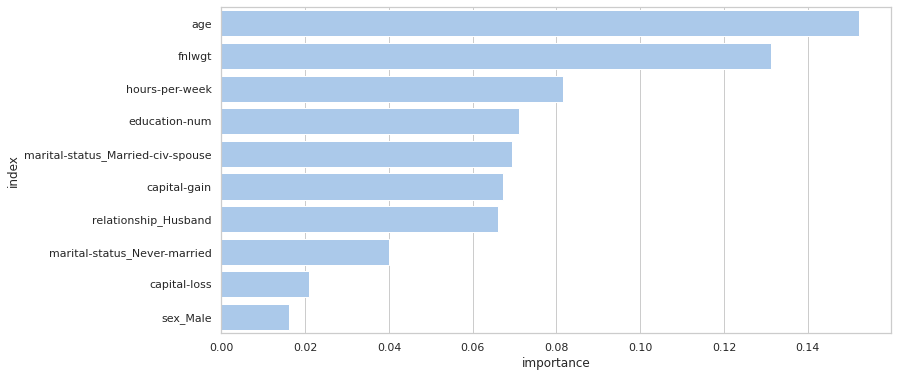

# Trained MLP for Census Income classification

💲 Predict whether income exceeds $50K/yr based on census data.

## Get started

The `predict_mlp.py` script will be soon, but now you can watch the demo using [notebook.](https://github.com/NazarPonochevnyi/Trained-MLP-for-Census-Income-classification/blob/main/Census_Income_notebook.ipynb)

## Dataset

We have used Census Income (Adult) dataset from [here.](https://archive.ics.uci.edu/ml/datasets/Census+Income)

There are 2 files (.data, .test), but they doesn't balanced, so we concatenate it to balance it manually. We got (48841 rows x 15 columns) dataframe with different types of data and missing values.


## Cleaning data

First of all we replace missing data and balance dataset by downsampling majority target column ('<=50K'). We got (11687 rows x 15 columns) dataframe.

After this we perform normalization, standartization and OneHot-Encoding of data using this map (map was builded using histograms of each column of the dataframe):

`
norm_map = {
    'age': 'standartization', 'workclass': 'onehot', 'fnlwgt': 'normalization', 'education': 'onehot', 
    'education-num': 'standartization', 'marital-status': 'onehot', 'occupation': 'onehot', 'relationship': 'onehot', 
    'race': 'onehot', 'sex': 'onehot', 'capital-gain': 'normalization', 'capital-loss': 'normalization', 
    'hours-per-week': 'standartization', 'native-country': 'onehot', 'salary': 'onehot'
}
`

## Data visualization

Let's look on Pirson's correlations:



There are small correlation, so, let's look how categorical data will separate 'Salary' values:



OK, let's see more about others categorical variables:



Now, let's see more about 'Age' variable:


And last, but not least is 3D graph:



## Classification

OK, let's start to build models: 

1. First of all divide data

```
X shape: (23374, 104)
Y shape: (23374, 2)
Training X shape: (15193, 104)
Training Y shape: (15193, 2)
Test X shape: (8181, 104)
Test Y shape: (8181, 2)
```

2. Build models

```
# kNN
knn = KNeighborsClassifier()
knn_model = MultiOutputClassifier(estimator=knn)

# Naive Bayes
nb = GaussianNB()
nb_model = MultiOutputClassifier(estimator=nb)

# SVM
svm = SVC(kernel='rbf', C=1e3, gamma=0.1)
svm_model = MultiOutputClassifier(estimator=svm)

# DecisionTree
dtree = DecisionTreeClassifier()
dtree_model = MultiOutputClassifier(estimator=dtree)

# RF
rf = RandomForestClassifier(n_estimators=10)
rf_model = MultiOutputClassifier(estimator=rf)

# MLP
x_shape, y_shape = X.shape[1], Y.shape[1]
mean_shape = (x_shape + y_shape) // 2

mlp_model = Sequential()
mlp_model.add(Dense(x_shape, input_shape=(x_shape,), activation='relu'))
mlp_model.add(Dense(mean_shape, activation='relu'))
mlp_model.add(Dense(y_shape, activation='softmax'))
es = EarlyStopping(monitor='val_accuracy', verbose=1, patience=5)
mlp_model.compile(loss='categorical_crossentropy', optimizer='adam', metrics=['accuracy'])
```

3. Fit and evaluate

```
kNN Test accuracy: 0.790
Naive Bayes Test accuracy: 0.699
SVM Test accuracy: 0.784
DecisionTree Test accuracy: 0.744
RF Test accuracy: 0.745
MLP Test accuracy: 0.815
```

4. Watch Confusion matrix



5. Watch Feature importances



## Build simplier model

Now we know the most important features (`age, fnlwgt,	hours-per-week,	education-num,	marital-status,	relationship`) and most accuracy model (`MLP`), so let's build simplier MLP model, but with the same accuracy on the test data!

1. New diviation of the data

```
X shape: (23374, 17)
Y shape: (23374,)
Training X shape: (15193, 17)
Training Y shape: (15193,)
Test X shape: (8181, 17)
Test Y shape: (8181,)
```

2. New model

```
Model: "sequential_1"
_________________________________________________________________
Layer (type)                 Output Shape              Param #   
=================================================================
dense_3 (Dense)              (None, 17)                306       
_________________________________________________________________
dense_4 (Dense)              (None, 9)                 162       
_________________________________________________________________
dense_5 (Dense)              (None, 1)                 10        
=================================================================
Total params: 478
Trainable params: 478
Non-trainable params: 0
_________________________________________________________________
```

3. Fit and evaluate

```
MLP Test accuracy: 0.806
```


## Weights

Model config and weights was saved to [`weights/` folder](https://github.com/NazarPonochevnyi/Trained-MLP-for-Census-Income-classification/tree/main/weights), you can use it to make predictions on the new data!

You can find an example in the [notebook](https://github.com/NazarPonochevnyi/Trained-MLP-for-Census-Income-classification/blob/main/Census_Income_notebook.ipynb) or the Python `predict_mlp.py` script that will be here soon.

## Licence

[MIT](./LICENSE)
